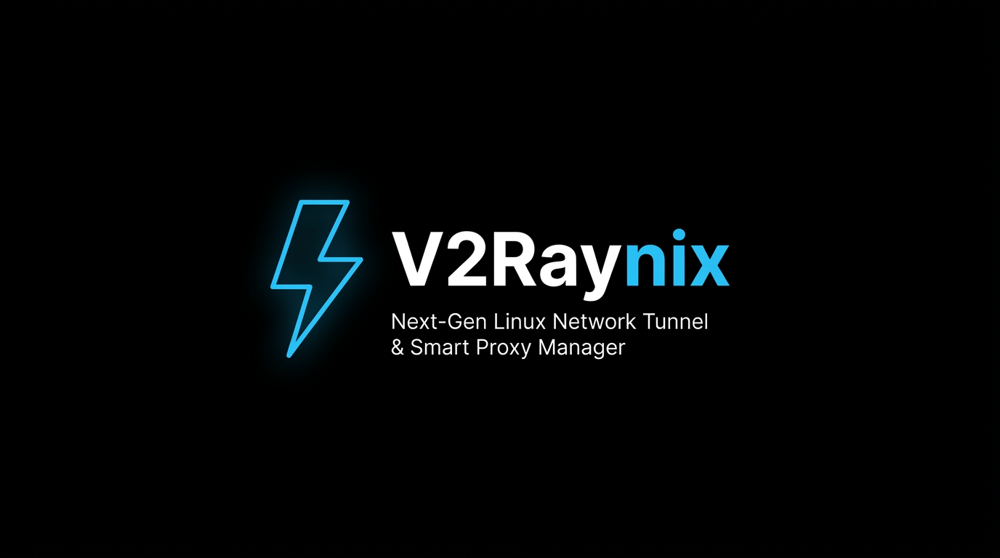

<h1 align="center">V2Raynix</h1>

<p align="center">
  
</p>

<p align="center">
  <b>Менеджер сквозного туннелирования и умной маршрутизации прокси для Linux нового поколения</b><br/>
  <i>Разработан на Go, Xray-core, tun2socks, политиках маршрутизации ядра Linux и встроенной панели React</i>
</p>

<p align="center">
  <a href="https://github.com/ImMahdi/V2Raynix/releases"></a>
  <a href="https://golang.org"></a>
  <a href="LICENSE"></a>
  
  
</p>

<p align="center">
  <a href="README.md"><b>English</b></a> •
  <a href="README.fa.md">🇮🇷 <b>فارسی</b></a> •
  <a href="README.zh-CN.md">🇨🇳 <b>简体中文</b></a> •
  <b>🇷🇺 Русский</b>
</p>

---

## 📑 Содержание

- [⚡ Быстрая установка в одну команду](#-быстрая-установка-в-одну-команду)
- [💡 Почему именно V2Raynix?](#-почему-именно-v2raynix)
- [🚀 Ключевые возможности](#-ключевые-возможности)
- [🏛️ Архитектура системы](#-архитектура-системы)
- [🖥️ Консольное меню управления (TUI)](#-консольное-меню-управления-tui)
- [🌐 Современная веб-панель управления](#-современная-веб-панель-управления)
- [⚙️ Параметры командной строки (CLI)](#-параметры-командной-строки-cli)
- [🛠️ Сборка из исходников (Опционально)](#-сборка-из-исходников-опционально)
- [💖 Поддержка проекта и донаты](#-поддержка-проекта-и-донаты)
- [🔒 Безопасность и правовая информация](#-безопасность-и-правовая-информация)
- [📄 Лицензия](#-лицензия)

---

## ⚡ Быстрая установка в одну команду

Установите и запустите V2Raynix на любом дистрибутиве Linux (**Ubuntu**, **Debian**, **CentOS**, **Fedora** или **Arch Linux**) с помощью **одной команды** в терминале — **без установки Go, Node.js и необходимости компиляции**:

```bash
bash <(curl -Ls https://raw.githubusercontent.com/ImMahdi/V2Raynix/master/scripts/install.sh)
```

### 🪄 Что скрипт выполняет автоматически:
1. **Определяет архитектуру процессора:** Поддерживаются `x86_64` (`amd64`) и `aarch64` (`arm64`).
2. **Проверяет и устанавливает зависимости:** Обеспечивает наличие `curl`, `unzip`, `iptables`, `iproute2` и `ca-certificates`.
3. **Устанавливает официальные движки:** Загружает актуальные релизы **Xray-core** и **tun2socks**, а также обновленные базы маршрутизации **GeoIP** и **GeoSite**.
4. **Устанавливает единый бинарный файл:** Загружает скомпилированный бинарник `v2raynix` со встроенным интерфейсом в `/usr/local/bin/v2raynix`.
5. **Настраивает брандмауэр:** Открывает веб-порт `2080` в `ufw` или `firewalld`.
6. **Создает и запускает службу systemd:** Регистрирует службу `v2raynix.service` и запускает её в фоновом режиме.

### 🌐 Вход в панель управления:
После завершения работы скрипта откройте в браузере:
```text
http://<IP-адрес-вашего-сервера>:2080
```
- **Логин по умолчанию:** `admin`
- **Пароль по умолчанию:** `admin` *(При первом входе или через консольное меню вам будет предложено изменить пароль)*

---

## 💡 Почему именно V2Raynix?

Управление прокси-клиентами на серверах Linux без графической оболочки традиционно сопряжено со сложностями и рисками. Ручное редактирование сложных файлов конфигураций JSON, отсутствие удобного управления виртуальными TUN-адаптерами, а главное — вмешательство в системные таблицы маршрутизации, которое часто приводит к **мгновенному обрыву активных сессий SSH и полной потере доступа к серверу**.

**V2Raynix** полностью устраняет эти проблемы:
1. **Защита от блокировки (Zero-Lockout Routing):** Автоматическое определение порта SSH, IP-адреса администратора и физического шлюза гарантирует, что сессии удаленного управления никогда не будут перенаправлены в прокси-туннель.
2. **120-секундный безопасный режим (Safe Mode):** Любое изменение сетевых маршрутов запускает защитный таймер обратного отсчета; если подтверждение работоспособности не получено, маршрутизация автоматически возвращается в исходное состояние, предотвращая сетевой блэкаут.
3. **Единый бинарник без внешних зависимостей:** Полноценный интерфейс React скомпилирован непосредственно внутрь бинарника Go (`go:embed`). Серверу не требуются среды Node.js, веб-сервер Nginx или внешние СУБД.
4. **Консольное меню настройки (TUI):** Удобный терминальный интерфейс с ANSI-оформлением (`v2raynix setup`) с бесшумным вводом пароля (как в `sudo` без отображения символов) и проверкой подтверждения.

---

## 🚀 Ключевые возможности

- **🌐 Сквозное туннелирование сервера (`tun2socks`):** Прозрачно направляет весь исходящий трафик Linux (TCP и UDP) через виртуальный интерфейс `tun0` в активную прокси-ноду.
- **🛡️ Двухуровневая защита управления:** Маршруты ядра направляют SSH-соединения (порт 22 или кастомный), трафик панели управления и прямые подключения напрямую через физический шлюз в обход `tun0`.
- **⏱️ Автоматический таймер отката Safe Mode:** 120-секундный предохранитель защищает от потери связи при сбоях в конфигах прокси.
- **⚡ Полная поддержка современных протоколов:**
  - **VLESS:** Поддержка транспортов `xhttp`, `reality`, `xtls-rprx-vision`, `ws`, `grpc` и `tcp`.
  - **VMess:** Полная поддержка AEAD, транспортов WebSocket, TCP и кастомных заголовков.
  - **Trojan:** Стандартные конфигурации TLS и WebSocket.
  - **Shadowsocks:** Современные шифры 2022 AEAD и классические методы.
- **🧠 Умная маршрутизация и нормализация GeoData:** Гибкие правила для доменов и IP-адресов (Direct / Proxy / Block). Автоматическая нормализация псевдонимов правил (например, перевод `geosite:ir` в `geosite:category-ir`) исключает аварийные сбои движка из-за несовместимости синтаксиса.
- **📊 Анализ задержки в реальном времени:** Двухуровневое измерение пинга — как базовый TCP-пинг, так и реальное сквозное время HTTP-рукопожатия.
- **🖥️ Безопасный TUI-интерфейс:** Консольная утилита с маскированием ввода паролей и защитой от случайных опечаток.
- **🔄 Обновление ядер в один клик:** Проверка и обновление движков `Xray-core` и `tun2socks` прямо из веб-интерфейса с проверкой контрольных сумм и атомарным откатом.

---

## 🏛️ Архитектура системы

```text
[ Исходящий системный сетевой трафик Linux ]
                      │
                      ▼
   ┌─────────────────────────────────────┐
   │    Политики маршрутизации ядра      │
   └──────────────────┬──────────────────┘
                      │
       ┌──────────────┴──────────────┐
       │ (SSH / Веб-порт / IP админа)│ (Весь остальной трафик)
       ▼                             ▼
┌──────────────┐              ┌──────────────┐
│  Физический  │              │  Виртуальный │
│    шлюз      │              │ адаптер tun0 │
└──────────────┘              └──────┬───────┘
                                     │
                                     ▼
                              ┌──────────────┐
                              │  tun2socks   │
                              └──────┬───────┘
                                     │ (SOCKS5 127.0.0.1:10808)
                                     ▼
                              ┌──────────────┐
                              │  Xray Core   │
                              └──────┬───────┘
                                     │ (VLESS / VMess / Trojan / SS)
                                     ▼
                        [ Удаленный прокси-сервер ]
```

---

## 🖥️ Консольное меню управления (TUI)

Если вам необходимо сбросить пароль, сменить порт веб-интерфейса или проверить статус службы прямо через консоль SSH без открытия браузера:

```bash
sudo v2raynix setup
```

```text
┌────────────────────────────────────────────────────────────┐
│                    V2RAYNIX SERVER SETUP                   │
├────────────────────────────────────────────────────────────┤
│  Service Status : ● Active (Running)                       │
│  Web Management : http://127.0.0.1:2080                    │
├────────────────────────────────────────────────────────────┤
│  [1] Change / Reset Admin Credentials                      │
│  [2] Change Web Panel Listening Port                       │
│  [3] Manage V2Raynix Service (Start / Stop / Restart)      │
│  [4] View Server Status & Diagnostics                      │
│  [0] Exit Setup                                            │
└────────────────────────────────────────────────────────────┘
```

> **Безопасность:** В пункте `[1]` при вводе нового пароля символы не отображаются на экране (по аналогии со стандартным вводом `sudo`), после чего запрашивается подтверждение пароля.

---

## 🌐 Современная веб-панель управления

Веб-интерфейс оформлен в современном темном стиле с элементами полупрозрачного стекла (glassmorphism):

- **Главная панель (Dashboard):** Графики скорости входящего/исходящего трафика в реальном времени, статус интерфейса tun0 и таймер Safe Mode.
- **Конфигурации (Узлы):** Импорт нод через ссылки (`vless://`, `vmess://`, `trojan://`, `ss://`) или raw JSON, пакетное тестирование задержек TCP и HTTP.
- **Умная маршрутизация:** Создание правил по доменам, IP и подсетям CIDR для прямого доступа, проксирования или блокировки с готовыми шаблонами.
- **Журнал событий (Logs):** Потоковый просмотр системных логов маршрутизации ядра Linux, фонового сервиса и движка Xray.
- **Настройки и обновление ядер:** Управление портами, настройка тайм-аута Safe Mode и онлайн-обновление движков Xray и tun2socks в один клик.

---

## ⚙️ Параметры командной строки (CLI)

```text
Usage: v2raynix [flags]
       v2raynix setup [subcommand flags]

Flags:
  -port int
        Порт для веб-панели и REST API (по умолчанию: 2080)
  -data-dir string
        Каталог для хранения настроек и состояния (по умолчанию: /etc/v2raynix или ./data)
  -init-password string
        Прямая инициализация или перезапись пароля администратора
  -mock
        Запуск в режиме симуляции без изменения сетевых интерфейсов ядра и iptables
  -version
        Вывести версию V2Raynix и выйти
```

---

## 🛠️ Сборка из исходников (Опционально)

<details>
<summary><b>Нажмите здесь для просмотра инструкций по ручной компиляции</b></summary>
<br/>

Если вы предпочитаете собрать проект вручную из исходного кода вместо использования автоматического скрипта:

### Требования:
- **Go:** Версия 1.23 или новее
- **Node.js и npm:** Версия 18+ (для сборки интерфейса React)
- **Make / Bash:** Стандартные утилиты сборки Linux

### Пошаговая сборка:

```bash
# 1. Клонирование репозитория
git clone https://github.com/ImMahdi/V2Raynix.git
cd v2raynix

# 2. Сборка React фронтенда
cd web
npm install
npm run build
cd ..

# 3. Компиляция единого исполняемого файла Go
go build -ldflags="-s -w" -o bin/v2raynix ./cmd/v2raynix

# 4. Локальный запуск в режиме симуляции
./bin/v2raynix -port 2080 -mock
```
</details>

---

## 💖 Поддержка проекта и донаты

V2Raynix — это независимый, бесплатный проект с открытым исходным кодом, созданный для поддержки свободы интернета и безопасного доступа к информации. Если этот инструмент оказался вам полезен, поддержите его развитие криптовалютным донатом!

### 📋 Адреса кошельков

| Сеть / Криптовалюта | Адрес |
| :--- | :--- |
| **BNB Smart Chain (BEP20)** | `0x726524eF2Bf606f12829C7724a37196E5fE00F44` |
| **Tron (TRC20)** | `TYkdrBjmJEMxXbxS6pwCujHvB18AS9WZ57` |
| **Bitcoin (BTC)** | `bc1qjyjat944wz466l3pz27953gfl69ey2wf66r2x4` |
| **Solana (SOL)** | `GevJAdW3x8Y8sqgDmYQf6VXGsoNny3hh8gFJthknC61W` |
| **Ethereum (ERC20)** | `0x726524eF2Bf606f12829C7724a37196E5fE00F44` |

<br/>

### 📱 QR-коды для доната

<div align="center">

| **BNB (BEP20)** | **Tron (TRC20)** | **Bitcoin (BTC)** | **Solana (SOL)** | **Ethereum (ERC20)** |
| :---: | :---: | :---: | :---: | :---: |
| <a href="repo_assets/qr-bnb.png"></a> | <a href="repo_assets/qr-trx.png"></a> | <a href="repo_assets/qr-btc.png"></a> | <a href="repo_assets/qr-sol.png"></a> | <a href="repo_assets/qr-eth.png"></a> |
| `0x7265...0F44` | `TYkd...WZ57` | `bc1q...r2x4` | `GevJ...C61W` | `0x7265...0F44` |

</div>

---

## 🔒 Безопасность и правовая информация

- **Привилегии Root:** Для настройки системной маршрутизации (`tun0`, `iptables`, `ip route`) требуются административные привилегии (`CAP_NET_ADMIN`, `CAP_NET_BIND_SERVICE`). Фоновая служба сбрасывает избыточные права, когда это возможно.
- **Отказ от ответственности:** Данное программное обеспечение предоставляется «как есть», без каких-либо явных или подразумеваемых гарантий. Пользователи несут личную ответственность за соблюдение законодательства и норм связи своей страны.

---

## 📄 Лицензия

Проект распространяется под свободной лицензией [MIT License](LICENSE).
Мы всегда рады вашим отзывам, замечаниям и Pull Request'ам!
