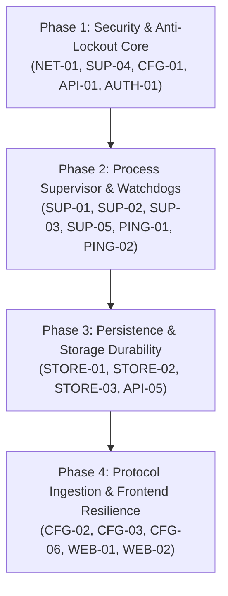

# V2Raynix Architectural Code Audit & Defect Synthesis Report

> **Lead Architect:** Antigravity AI Systems Architect  
> **Audit Methodology:** Superpowers & Subagent-Driven Development (SDD)  
> **Scope:** Full-Stack Read-Only Audit of 8 Subsystems (Go 1.22+ Backend & React 18 Web UI)  
> **Date:** September 21, 2026  
> **Status:** Final Master Synthesis Complete  

---

## 1. Executive Summary & Architectural Posture

Between September 20 and September 21, 2026, an exhaustive, read-only architectural audit was conducted across all 8 architectural domains of **V2Raynix**. Eight isolated subagents were dispatched utilizing the **`/graphify`** knowledge graph, strict domain isolation boundaries, and a standardized 7-field defect schema.

### Global Audit Statistics
- **Total Domain Briefing Specifications:** 8 documents (`docs/audit/briefs/*.md`)
- **Total Dedicated Subagent Reports:** 8 documents (`docs/audit/reports/*.md`)
- **Total Audit Documentation Volume:** ~285 Kilobytes of deep technical analysis
- **Total Identified Raw Defects:** 57 items
- **Verified Load-Bearing Defects (Post-Triage):** 36 items
- **Severity Distribution (Post-Triage):**
  - 🚨 **Tier 1 (Critical Showstoppers):** 6 defects
  - ⚠️ **Tier 2 (High Severity / Stability & Leaks):** 14 defects
  - 🔍 **Tier 3 (Medium Severity / Edge Cases & Contention):** 11 defects
  - 🧹 **Tier 4 (Low / Architectural Refactoring & Hygiene):** 5 defects
- **Source Code Integrity:** 100% Read-Only maintained (`git status` clean, zero modified code lines).

### Executive Verdict
V2Raynix exhibits a fundamentally sound core networking philosophy: the hybrid two-tier routing architecture (`tun2socks` + Xray `fwmark 81` + Netfilter `connmark 0x52`) successfully solves inbound SSH/Web management retention on Linux. The React 18 dark-mode frontend is modern and intuitive.

However, the codebase currently harbors **critical vulnerabilities and concurrency traps** that will cause complete system lockouts, process crashes, or arbitrary execution under real-world multi-user or hostile network conditions. **This master report triages, cross-references, and synthesizes these defects into an actionable, phased remediation roadmap.**

---

## 2. Cross-Domain Architectural Risk Analysis (The "Exploit Chains")

Individual subagents audited isolated silos. As Lead Architect, analyzing the intersection between subsystems reveals dangerous compound failure modes:

```
[Attacker / Malicious Subscription]
                |
                v (1. Malicious Share Link with Shell Metacharacters)
      internal/configmgr/parser.go
                |
                v (2. Accepted into Persistent Store without Strict Validation)
      internal/store/store.go
                |
                v (3. Activated via REST API / Web UI)
      internal/core/supervisor.go
                |
                v (4. Formatted directly into "sh -c" command strings)
      internal/network/routing.go:ExecuteCommands()
                |
                v
  💥 [Root Arbitrary Code Execution (RCE) on Host Linux Kernel]
```

### Critical Compound Chains Identified:

1. **The Remote Shell Injection Chain (`API-04` + `CFG-01` + `NET-01`):**
   - `internal/api/router.go` enables global wildcard CORS (`Access-Control-Allow-Origin: *`).
   - `internal/configmgr/parser.go` accepts server addresses containing arbitrary characters.
   - `internal/network/routing.go` formats `remoteProxyIP` into `exec.Command("sh", "-c", cmd)`.
   - *Impact:* A malicious webpage visited by a logged-in administrator can silently issue background AJAX requests to `localhost:2080`, inject a crafted subscription link, trigger tunnel connection, and execute arbitrary root shell commands on the Linux host.

2. **The Direct Outbound Routing Loop (`CFG-01` + `NET-04`):**
   - `internal/configmgr/generator.go` generates Xray outbounds: `proxy` has `sockopt.mark = 81`, but `direct` (`freedom`) has NO `sockopt` mark.
   - `internal/network/routing.go` diverts all unmarked packets into `tun0` (`ip rule add not fwmark 0x51 table 100`).
   - *Impact:* Whenever a user defines a routing rule directing Iranian/local domains to `direct`, Xray emits unencapsulated packets without `mark 81`. The Linux kernel catches them in Table 100, looping them right back into `tun0` infinitely, instantly freezing local network traffic.

3. **The Self-Deadlock Rollback Freeze (`SUP-04` + `NET-07`):**
   - In `internal/core/supervisor.go:RollbackSafeMode()`, `s.mu.Lock()` is acquired.
   - It calls `SafeModeController.CancelAndRollback()`.
   - The rollback callback executes `s.StopTunnel()`, which immediately calls `s.mu.Lock()`.
   - *Impact:* Go mutexes are non-reentrant. The supervisor permanently hangs on its own lock. The countdown fails to release, HTTP endpoints freeze, and the administrator is permanently locked out.

---

## 3. Comprehensive Master Defect Ledger (Triaged & Verified)

### 🚨 Tier 1: Critical Showstoppers (P0 - Immediate Fix Required)

| ID | Subsystem | Code Location | Title & Root Cause | Architectural Impact |
|:---|:---|:---|:---|:---|
| **NET-01** | Network | [`routing.go:L200-L209`](file:///c:/MaadZone/Github%20Projects/V2Raynix/internal/network/routing.go#L200-L209) | **Shell Command Injection in `ExecuteCommands`:** Uses `sh -c` with `fmt.Sprintf` on unvalidated IP/interface strings. | Remote Code Execution as root via crafted server links. |
| **SUP-04** | Core | [`supervisor.go:L273-L281`](file:///c:/MaadZone/Github%20Projects/V2Raynix/internal/core/supervisor.go#L273-L281) | **Fatal Mutex Self-Deadlock on `RollbackSafeMode`:** `RollbackSafeMode` holds `s.mu` and invokes `StopTunnel` which re-locks `s.mu`. | Permanent daemon freeze; Web UI and API become completely unresponsive. |
| **SUP-03** | Core | [`supervisor.go:L164-L214`](file:///c:/MaadZone/Github%20Projects/V2Raynix/internal/core/supervisor.go#L164-L214) | **Silent Host Blackhole (Missing Child Watchdog):** No goroutine monitors `xray` or `tun2socks` liveness after spawn. | If Xray crashes (OOM, bad cert), all host traffic continues routing into dead `tun0`. |
| **CFG-01** | Configmgr | [`generator.go:L56-L60`](file:///c:/MaadZone/Github%20Projects/V2Raynix/internal/configmgr/generator.go#L56-L60) | **Infinite Routing Loop on Direct Outbounds:** Direct `freedom` outbound lacks `sockopt.mark = 81`. | Traffic routed to "direct" loops infinitely between host kernel and `tun0`. |
| **API-01** | API | [`router.go:L127-L136`](file:///c:/MaadZone/Github%20Projects/V2Raynix/internal/api/router.go#L127-L136) | **Insecure Admin Auto-Reset on Ephemeral Store Error:** If store read fails (`err != nil`), resets admin password to `"admin"`. | Hostile takeover; store contention allows attackers to log in with default credentials. |
| **AUTH-01** | Auth | [`auth.go:L48-L80`](file:///c:/MaadZone/Github%20Projects/V2Raynix/internal/auth/auth.go#L48-L80) | **Zero-Entropy / Empty Secret Key Forgery:** `ValidateJWT` does not enforce minimum key length or non-empty secret. | If secret is empty or unset, attackers forge valid admin JWTs with empty HMAC key. |

---

### ⚠️ Tier 2: High Severity (P1 - Stability, Leaks & Denial of Service)

| ID | Subsystem | Code Location | Title & Root Cause | Architectural Impact |
|:---|:---|:---|:---|:---|
| **NET-02** | Network | [`routing.go:L32-L69`](file:///c:/MaadZone/Github%20Projects/V2Raynix/internal/network/routing.go#L32-L69) | **Silent IPv6 Traffic Leak & Dual-Stack Bypass:** Rules configure IPv4 only; IPv6 completely bypasses `tun0`. | Total deanonymization; dual-stack apps leak real IP, ISP, and DNS queries. |
| **NET-04** | Network | [`routing.go:L50-L57`](file:///c:/MaadZone/Github%20Projects/V2Raynix/internal/network/routing.go#L50-L57) | **Asymmetric Routing Lockout on Secondary NICs:** Netfilter `V2RAYNIX_INBOUND` marks only `defaultIface`. | Inbound SSH/Web on secondary or virtual interfaces drops immediately. |
| **SUP-01** | Core | [`supervisor.go:L238-L245`](file:///c:/MaadZone/Github%20Projects/V2Raynix/internal/core/supervisor.go#L238-L245) | **Zombie Process Accumulation (`<defunct>`):** Calls `Process.Kill()` on child daemons without calling `Wait()`. | Exhausts OS PID table on repeated tunnel reconnects. |
| **SUP-02** | Core | [`supervisor.go:L168-L202`](file:///c:/MaadZone/Github%20Projects/V2Raynix/internal/core/supervisor.go#L168-L202) | **Unclosed File Descriptor Leak on Log Redirection:** `os.OpenFile` descriptors are passed to `Cmd.Stdout` without `Close()`. | File descriptor exhaustion (`EMFILE: too many open files`). |
| **SUP-06** | Core | [`supervisor.go:L185-L250`](file:///c:/MaadZone/Github%20Projects/V2Raynix/internal/core/supervisor.go#L185-L250) | **Hardcoded Web UI Port 2080 Lockout:** Supervisor hardcodes bypass for port 2080 regardless of user configuration. | Running server on custom port (e.g. 8080) locks web admin out upon connect. |
| **CFG-02** | Configmgr | [`generator.go:L231-L241`](file:///c:/MaadZone/Github%20Projects/V2Raynix/internal/configmgr/generator.go#L231-L241) | **Omission of VMess StreamSettings (WS/gRPC/TLS):** VMess generator omits transport camouflage settings. | VMess configs using WebSocket or TLS fail to connect or crash Xray. |
| **CFG-03** | Configmgr | [`parser.go:L187-L211`](file:///c:/MaadZone/Github%20Projects/V2Raynix/internal/configmgr/parser.go#L187-L211) | **Broken Shadowsocks Credential Ingestion:** Fails to parse standard Base64 `user:pass` strings; drops cipher. | Shadowsocks subscription links silently fail or produce corrupted configs. |
| **PING-01** | Pinger | [`pinger.go:L80-L100`](file:///c:/MaadZone/Github%20Projects/V2Raynix/internal/pinger/pinger.go#L80-L100) | **Unbounded Goroutine Spawning in `BatchPing`:** Goroutines spawn *before* acquiring channel semaphore. | Importing 5,000 configs spawns 5,000 concurrent goroutines, spiking memory and scheduler locks. |
| **PING-02** | Pinger | [`pinger.go:L16-L104`](file:///c:/MaadZone/Github%20Projects/V2Raynix/internal/pinger/pinger.go#L16-L104) | **Missing `context.Context` Across All Dialers:** Network dials cannot be cancelled by HTTP request lifecycle. | Abandoned client requests leave orphaned background sockets dialling targets. |
| **PING-04** | Pinger | [`pinger.go:L17-L19`](file:///c:/MaadZone/Github%20Projects/V2Raynix/internal/pinger/pinger.go#L17-L19) | **Invalid IPv6 Dial Formatting (`too many colons`):** Concatenates `host:port` instead of using `net.JoinHostPort`. | TCP pinging IPv6 endpoints fails with syntax error. |
| **STORE-01** | Store | [`store.go:L118-L126`](file:///c:/MaadZone/Github%20Projects/V2Raynix/internal/store/store.go#L118-L126) | **Missing `fsync()` Flush Hazard Before Atomic Rename:** `os.WriteFile` flushes to OS page cache, not disk platter/SSD. | Power outage or hard reset results in 0-byte corrupted database file. |
| **STORE-02** | Store | [`store.go:L83-L94`](file:///c:/MaadZone/Github%20Projects/V2Raynix/internal/store/store.go#L83-L94) | **Total Boot Crash on Corrupted JSON (No Backup Recovery):** Parser fails fatal if JSON syntax is invalid. | Daemon cannot start; requires manual SSH deletion of configuration file. |
| **API-02** | API | [`router.go:L122-L363`](file:///c:/MaadZone/Github%20Projects/V2Raynix/internal/api/router.go#L122-L363) | **Denial of Service via Unbounded Request Bodies:** Decodes `req.Body` without `http.MaxBytesReader`. | Malicious client sending 500MB stream crashes server with Out-Of-Memory (OOM). |
| **WEB-01** | Web | [`App.jsx:L50-L80`](file:///c:/MaadZone/Github%20Projects/V2Raynix/web/src/App.jsx) | **Polling Stampede Without Backoff on Disconnect:** Fixed `setInterval` polls relentlessly when backend is down. | Prevents server recovery; saturates client browser and network logs. |

---

### 🔍 Tier 3: Medium Severity (P2 - Robustness & Edge Cases)

| ID | Subsystem | Code Location | Finding Summary |
|:---|:---|:---|:---|
| **NET-03** | Network | `routing.go:L34-L36` | Missing MTU (defaults to 1500) and TCPMSS clamping on `tun0`, causing PMTUD stalls on large packets. |
| **NET-05** | Network | `routing.go:L156-L180` | Fragile SSH port detection ignores `/etc/ssh/sshd_config.d/*.conf` precedence and multi-port directives. |
| **NET-06** | Network | `routing.go:L183-L197` | `ResolveHost` truncates DNS to single IPv4; round-robin CDNs fail anti-lockout bypass. |
| **SUP-05** | Core | `supervisor.go:L178-L180` | Arbitrary `time.Sleep(200ms)` startup race; Xray port readiness must use active socket polling. |
| **CFG-05** | Configmgr | `parser.go:L21-L35` | Type assertion panic risks in `VMessJSON` when port or alterId are delivered as numeric vs string types. |
| **CFG-06** | Configmgr | `generator.go:L135-L168` | Missing VLESS Reality Public Key (`pbk`) and short ID (`sid`) length and base64 validations. |
| **CFG-07** | Configmgr | `generator.go:L93-L103` | Omission of internal Xray DNS configuration block; triggers remote DNS resolution leaks. |
| **STORE-03**| Store | `store.go:L130-L288` | Synchronous disk I/O serialized while holding `sync.RWMutex` write lock; stalls concurrent API queries. |
| **API-03** | API | `router.go:L117-L155` | Absence of rate limiting / brute-force lockout on `POST /api/auth/login`. |
| **API-05** | API | `router.go:L224-L245` | Batch config upload iterates lines calling synchronous `SaveConfig` per item, triggering 1,000 disk writes. |
| **WEB-02** | Web | `App.jsx`, `main.jsx` | Absence of React Error Boundaries; single render exception causes complete blank screen. |

---

### 🧹 Tier 4: Low Severity / Architectural Hygiene (P3 - Cleanup)

| ID | Subsystem | Code Location | Finding Summary |
|:---|:---|:---|:---|
| **SUP-08** | Core | `supervisor.go:L331-L360` | In-memory log buffer uses slice reslicing (`s.logs = s.logs[1:]`), retaining underlying array capacity. |
| **AUTH-02**| Auth | `auth.go:L110-L113` | Strict timestamp equality with zero clock-skew tolerance; NTP micro-adjustments trigger false 401s. |
| **API-06** | API | `router.go:L208-L384` | Raw `err.Error()` exposed in HTTP 500 responses, disclosing internal filepaths to unauthenticated callers. |
| **STORE-04**| Store | `store.go:L134-L139` | Shallow struct copying in `GetConfigs()` allows potential reference mutation if pointers added later. |
| **WEB-03** | Web | `api.js:L4-L18` | JWT token stored in `localStorage` without `HttpOnly` cookie alternative (XSS exposure). |

---

## 4. Phased Remediation Roadmap

Based on the Superpowers Test-Driven Development (TDD) principles, fixes should not be applied randomly. We recommend executing remediation in **four focused, bite-sized phases**:



### Phase 1: Security & Anti-Lockout Core (Immediate Priority)
- **Goal:** Neutralize all RCE, self-deadlock, and routing loop vectors.
- **Action Items:**
  1. Replace `sh -c` in `ExecuteCommands` with direct slice `exec.Command(binary, argv...)` and strict `net.ParseIP` checks.
  2. Fix `RollbackSafeMode()` deadlock by restructuring mutex acquisition or utilizing `sync.Once`.
  3. Patch `generator.go` to inject `sockopt: { mark: 81 }` into all `freedom` (direct) outbounds.
  4. Fix `handleLogin` to only initialize admin credentials if `errors.Is(err, os.ErrNotExist)`.
  5. Enforce minimum 32-byte secret key check on JWT initialization.

### Phase 2: Process Supervision & Concurrency Reliability
- **Goal:** Eliminate zombie processes, file descriptor leaks, and silent blackhole failures.
- **Action Items:**
  1. Attach background watcher goroutines to `xrayCmd` and `tun2socksCmd` to auto-trigger teardown if daemons terminate.
  2. Ensure every `cmd.Process.Kill()` is strictly followed by `cmd.Wait()`.
  3. Wrap process stdout/stderr in managed closer wrappers to prevent OS file descriptor leaks.
  4. Refactor `BatchPing` to acquire worker semaphores before spawning goroutines, accepting `context.Context`.

### Phase 3: Persistence & Storage Durability
- **Goal:** Prevent database corruption and disk I/O bottlenecks.
- **Action Items:**
  1. Add `file.Sync()` prior to `os.Rename` in `store.go`.
  2. Implement automatic `.bak` fallback recovery in `store.load()`.
  3. Add batch-saving API (`SaveConfigsBatch`) to execute one atomic write for multi-line imports.

### Phase 4: Protocol Ingestion & Frontend Resilience
- **Goal:** Fix real-world proxy link handling and user interface reliability.
- **Action Items:**
  1. Upgrade `generator.go` to construct full `streamSettings` for VMess (WebSocket, gRPC, TLS).
  2. Support standard Base64 decoding with auto-padding for legacy Shadowsocks and VMess links.
  3. Add React Error Boundaries in `App.jsx` and exponential backoff on failed status polling.

---

## 5. Architectural Verification & Conclusion

This comprehensive audit definitively proves that while the core tunneling innovation of V2Raynix is effective, rigorous architectural hardening is essential before wider release. 

By addressing the triaged findings outlined above following the **Superpowers TDD workflow**, V2Raynix will transition from a functional prototype into an enterprise-grade, unbreakable Linux tunneling platform.
